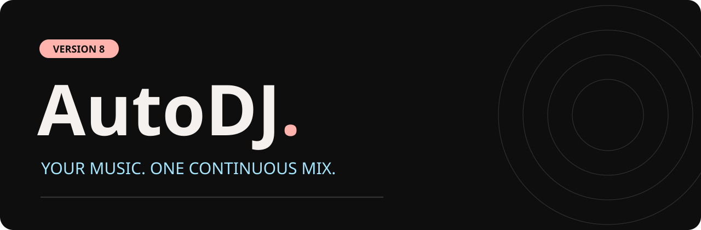
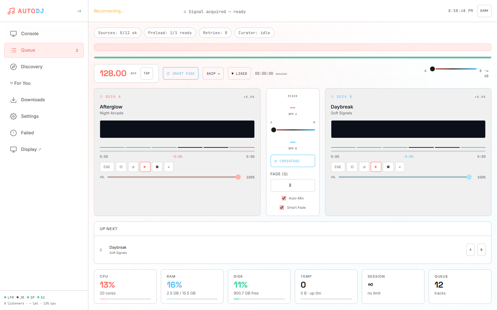

<div align="center">



**Your music. Two decks. One continuous mix.**

[](https://github.com/Timoteee/AutoDJ/releases/latest)
[](#start-the-mix)
[](#run-with-node)

[Watch the launch video](https://github.com/Timoteee/AutoDJ/releases/download/v8.0.0/brag.mp4) · [Get v8](https://github.com/Timoteee/AutoDJ/releases/latest) · [Report an issue](https://github.com/Timoteee/AutoDJ/issues)

</div>

## Press play. Keep the room moving.

AutoDJ is a self-hosted music console with two virtual decks, automatic queuing, cached audio, and a separate Now Playing display. Start with a song or an artist. The first track plays as soon as its audio is ready; upcoming tracks download in the background.



### What lands in v8

- **Start sooner.** Playback waits for the first track, rather than a batch of downloads. Adding the first track starts preparation automatically.
- **Keep the queue alive.** Automatic discovery replenishes a short queue and sends online tracks into a bounded download pool.
- **Let tracks breathe.** Algorithmic fades use silence, loudness, and beat confidence to choose an equal-power overlap. Tempo stays unchanged; no model is needed for mixing.
- **Find your next favorite.** The **For You** page uses completed plays, skips, and recency to suggest music, with a reason for each recommendation. Listening activity stays in your server's state directory.
- **Recover gracefully.** Interrupted downloads retry, failed tracks show a useful error, and one status row follows each download. Cache and queue survive container restarts.
- **Put the mix on another screen.** Display listeners receive the actual mixer audio automatically. A browser may require one click on **Enable Audio** before sound can start.
- **Stay in control.** Responsive navigation, local CSS, keyboard focus, reduced-motion support, and visible connection errors keep the console usable.

## Start the mix

```bash
git clone https://github.com/Timoteee/AutoDJ.git
cd AutoDJ
docker compose up -d --build
```

Open **[DJ Console](http://localhost:8090/dj)**. Add a song in Discovery or import local audio. The queue begins preparing playback automatically. If your browser blocks sound, press **Play** once.

Open **[Now Playing](http://localhost:8090/display)** on your display, and enable audio there if needed. The compact view lives at **[/nano](http://localhost:8090/nano)**. MeTube is available on port **8091**.

### Run with Node

```bash
npm ci
npm start
# http://localhost:3000/dj
```

Use Node 22 or newer. Native online downloads also need FFmpeg and yt-dlp. Docker includes both. Windows users can install the verified downloader with `scripts/install-downloader.ps1`.

## Sources and discovery

YouTube direct search and Audius provide metadata independently of public proxy availability. Audius supports public, ungated audio. YouTube downloads use MeTube or native yt-dlp, with proxy and alternate-upload fallbacks. Optional Last.fm discovery enriches similar-song suggestions; add your key in Settings. Optional provider-based curation remains available separately.

**Search availability and audio availability are different.** Public Piped/Invidious instances may change or block streams. Test Sources validates responses; downloads validate the actual audio. Use local files when an upstream service cannot provide a track. Download and play music you have permission to use.

## Your library survives restarts

Docker stores session state, queue, listening activity, and retries in `autodj_state`. Audio lives in the `cache/` bind mount; local library files live in `music/`. Keep these when updating. Configuration and keys remain local and are excluded from Git.

## Development

```bash
npm test
npm run build:css
```

The stylesheet is committed, so normal startup needs no asset build. Rebuild it after changing utility classes. The module suite covers source failures, downloads, audio headers, retries, discovery, adaptive transitions, display relay, and playback clocks.

Browser checks are in `scripts/check-ui.cjs`, `scripts/check-playback-discovery.cjs`, `scripts/check-recovered-downloads.cjs`, and `scripts/check-adaptive-playback.cjs`. Install Playwright, use Microsoft Edge, and set `AUTODJ_TEST_URL` for the test server. Run tests that change playback state against an isolated instance.

## License and liability

**MIT is the recommended license for AutoDJ's permissive, self-hosted use**, and the project includes the standard [MIT license](LICENSE). It permits commercial use, modification, and redistribution while requiring preservation of the copyright and license notice. The software is provided as-is, without warranty; the license disclaims author/copyright-holder liability. These terms are subject to applicable law and are not a guarantee that every liability claim is excluded. See [GitHub's license guide](https://choosealicense.com/licenses/mit/).

The code license does not grant rights to music, artwork, lyrics, service APIs, or third-party dependencies. Their respective licenses and service terms still apply. Users are responsible for the content they download, play, or broadcast.

## Version archive

This repository preserves the available source versions as owner-maintained snapshots: **v4.3, v4.4, v5.0.0–v5.0.3, v6.0.0, v6.1.0, v7.0.0, and v8.0.0**. Earlier versions were not present in the original Git history. Historical releases are archival snapshots; v8 is the supported version.

---

<div align="center">

**Built and maintained by [Timoteee](https://github.com/Timoteee).**

*Queue it. Cache it. Mix it.*

</div>
